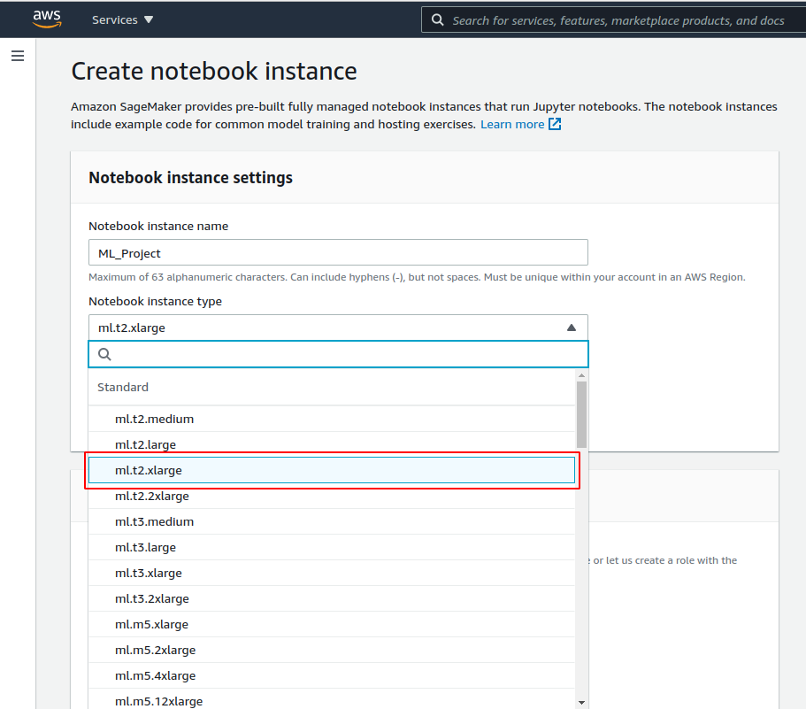
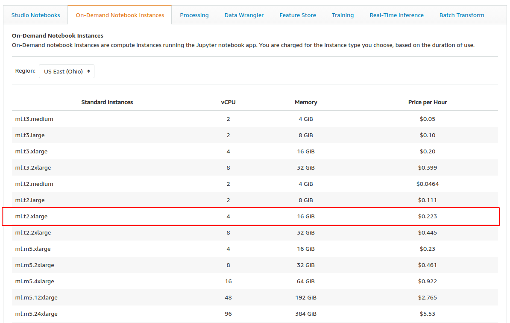
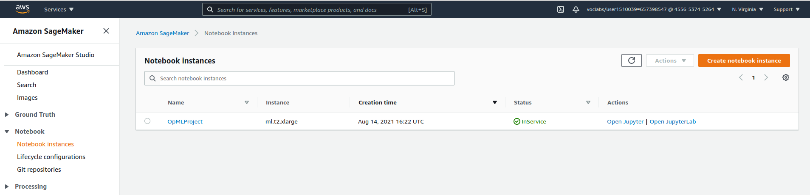
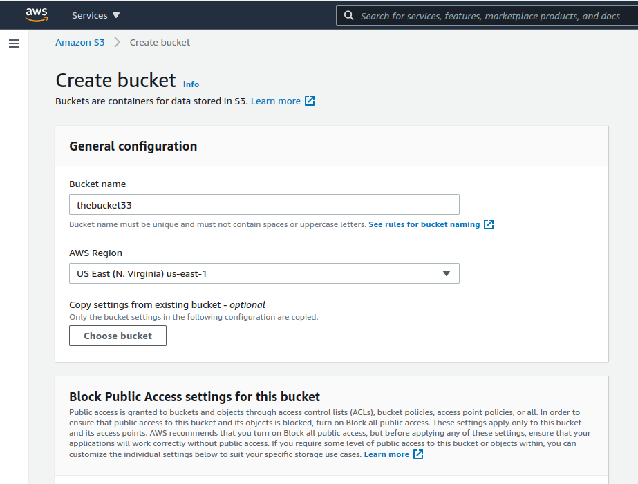
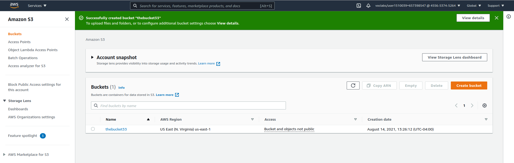

# AWS-Operationalizing-ML-Project

## Training and deployment

Setting up a Sagemaker instance:

ml.t2.xlarge is a suitable notebook instance for this project as it has suficient memory form data hangling and is still relatively cheap instance. It has 4 vCPU, 16 GiB and it costs $0.223 per hour. Other avaliable instances can be seen in the following table:

The created notebook instance:

Setting up a S3 Bucket for the project:

